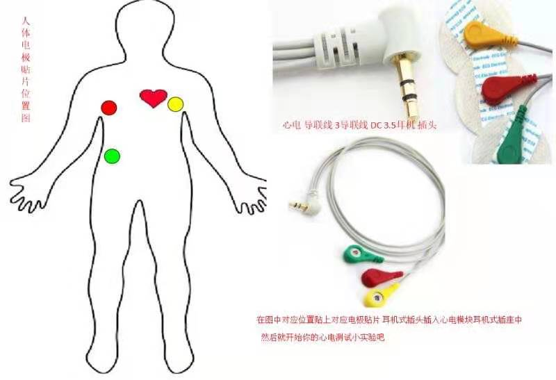
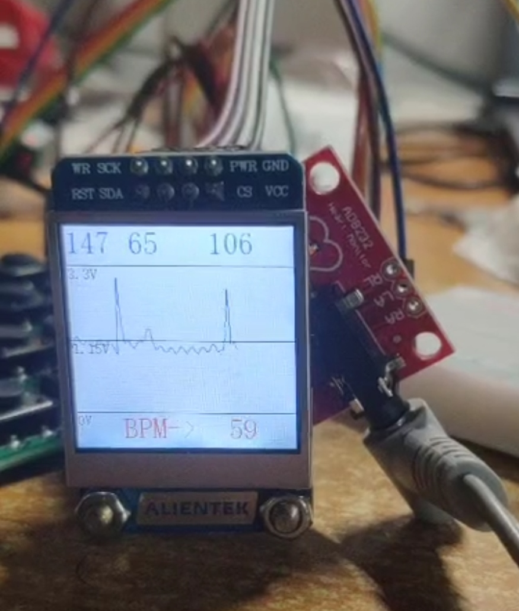

# Heart_Rate_Datector

> 2020秋感测综设-心电检测器

> 已更新心率测量代码，欢迎issues~随缘star🙆‍♂️

@Designed by Dawn

## 1. 主要信息

1. 芯片: STM32RCT6
2. 模块: AD8232,  正点原子TFT-LCD 1.3 '
3. 软件: MDK5 

## 2.功能

1. 读取AD8232所测量到的心电信号电压，并显示在LCD屏幕。

   导联接法：

   

   实现效果：

   

2. 采用动态阈值法实时测量心率，实时更新。

3. 多次脉搏平均进行心率计算，较为稳定。

4. Labview心电信号波形显示。

5. Labview上位机网页发布与远程控制

## 3.待更新

1. 按键切换模式，多次脉搏平均计算心率。
2. 传送数据至PC，labview显示，并发布至网页端。

